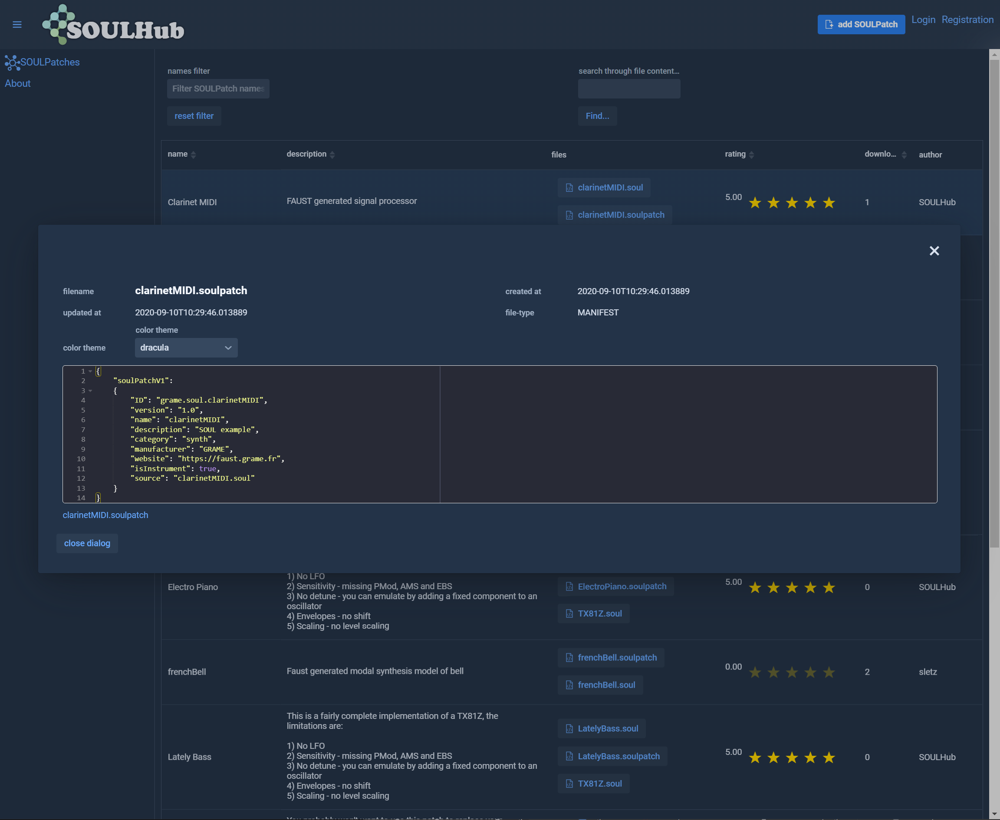
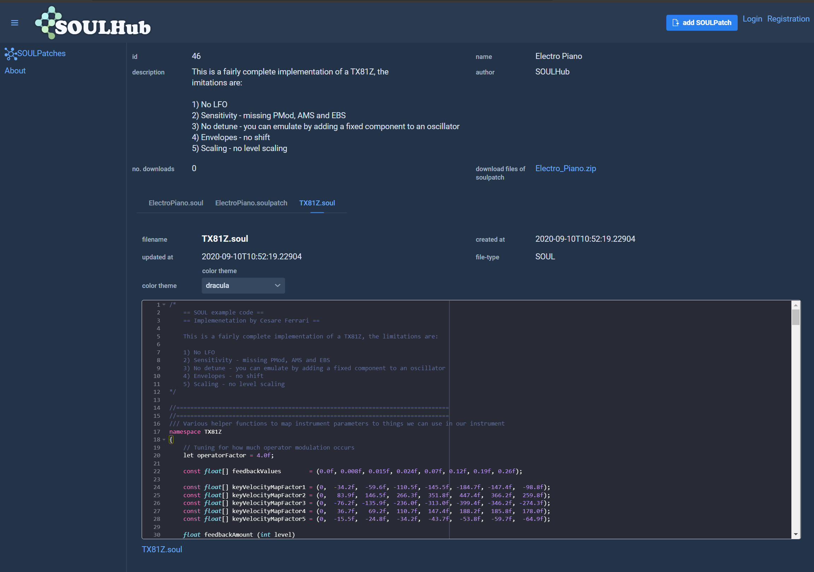

# SOULHub

Web-application that serves the SOUL (Sound Language) community as a SOULPatch Exchange.

For users to edit and publish their SOULPatches and easily find public SOULPatches created by others.

The open API invites other systems, like IDE Plugins specialized in SOUL, 
 or a discord bot (in the planning ;)) to connect to SOULHub, so sticking soulpatches together
 gets a bit closer to playing LEGO, where the right pieces just fall into your lap.
 
### images of the web-ui
 

#### the fastest way to build and run SOULHub as Webapp in Docker

## Prerequisites

* maven
* jdk 14
* docker
* docker-compose

## build

run

- `./build_and_run_app_db_docker.sh`

or

- `build_and_run_app_db_docker.cmd`

or manually

1. `mvn spring-boot:build-image -Pproduction`
2. `docker-compose build && docker-compose up`

## finally

goto localhost:8080

## about this build

This takes a long time. If you're a c++ developer: This takes basically no time.

Compiles the frontend to javascript and runs two docker container
for the SOULHub app and postgres. 

Postgres is spun up with a default postgres db for the
user postgres with the password postgres. Make sure it's not accessible from the outside (Port 5432).

If no database exists (initial launch) the two sql scripts ./sql/10_schema.sql
and ./sql/20_data.sql get executed. This creates the tables and inserts test-data and
test-users.

Login with the user 'dbuser1' and password 'password' in SOULHub (localhost:8080).
